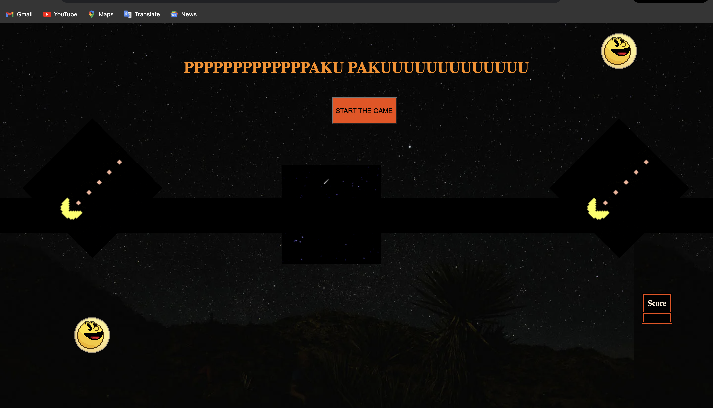
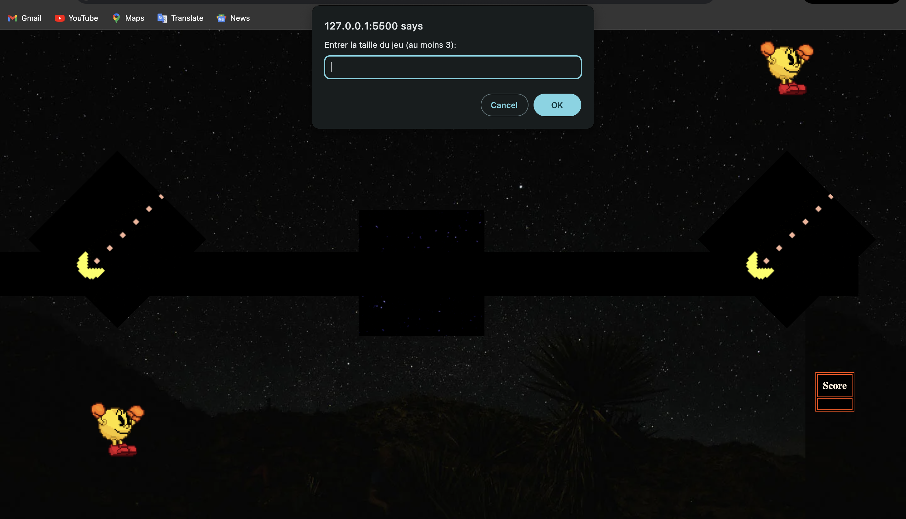
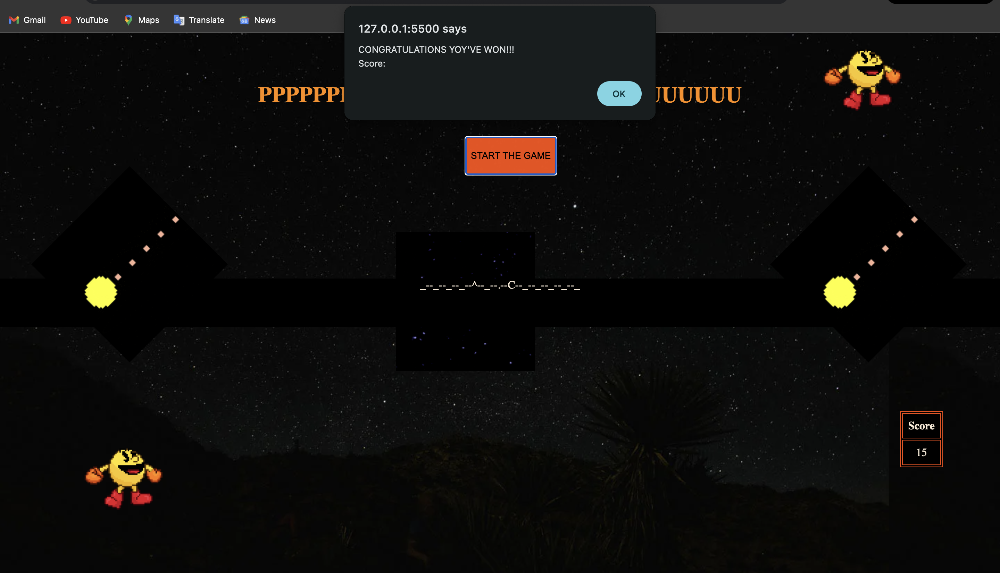
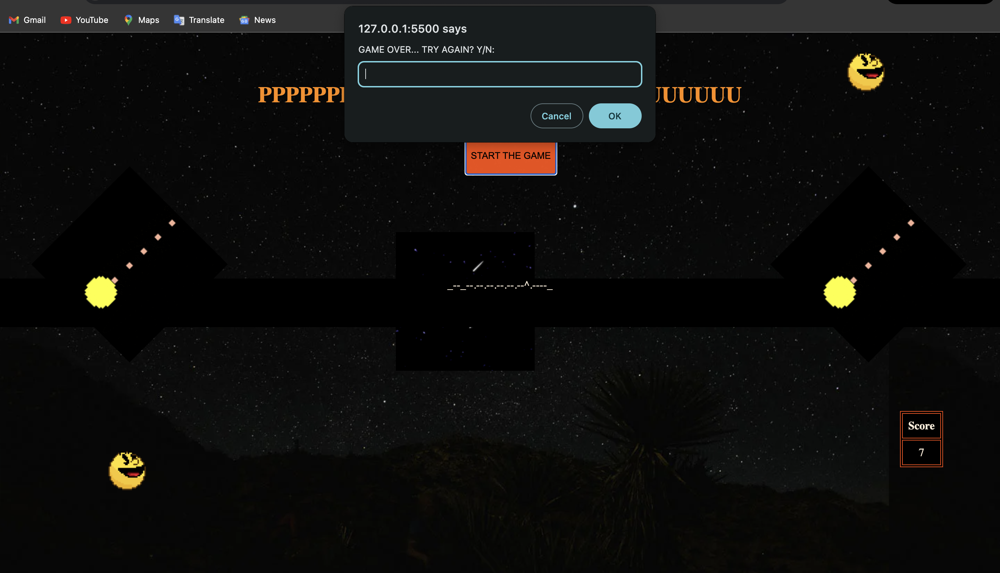
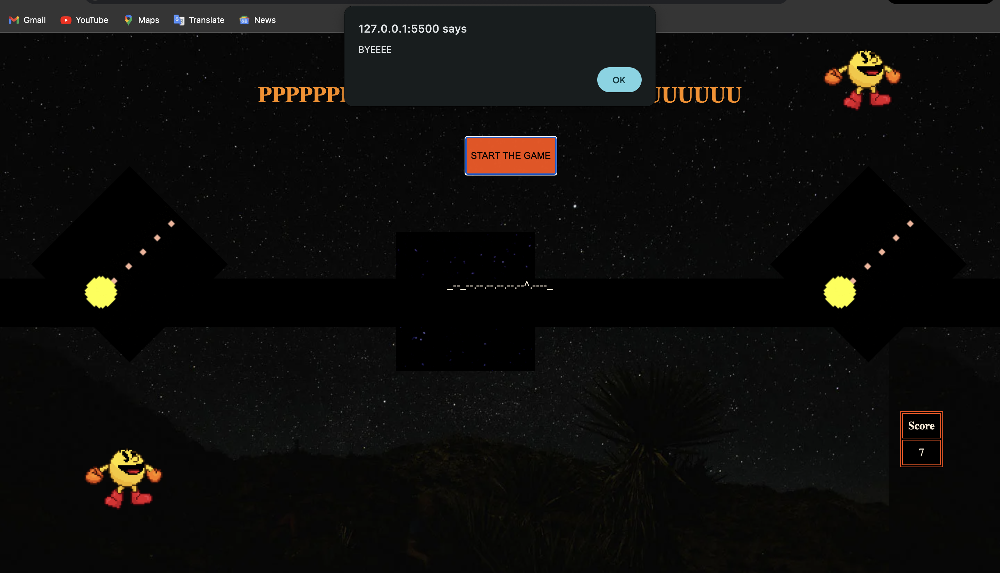

# Devoir 2: Pacman 1D

Il s'agit d'un jeu de pac man basique sur une dimension.

## Start
Pour commencer le jeu il faut d'abord appuyer sur le bouton "Start the game".  
Le program demande d'insérer la taille de jeu souhaiter. Celle-ci devant être d'au moins 3 (bien que ce ne soit pas suffisant pour jouer). 
Le tableau de score comme on peut le voir est initialement vide et commencera à monter une fois la partie commencée.

## Gameplay
ce programe se joue de la meme maniere que n'importe quel autre jeu de Pacman. Etant juste en une dimension on pourra utiliser les touches gauche et droite du clavier. Le fantome se deplace chaque 600ms dans la direction du pacman. Chaque pastilles rapporte 1 point et le fruit lui rapporte 5 points
Le jeu continue jusqu'a ce que pacman ne mange toute les pastilles et fruit ou jusqu'a ce que le fantome ne l'attrape. 

## Design
### Colors

- **Text** : antiquewhite, darkorange;

- **Button Background** : rgba(255, 77, 0, 0.947)

- **Background div/table** : black

- **Score board** : black

### Layout
l'interface du jeu a les element suivants: 
1. **Header** (PAKU PAKU): etant un autre nom du jeu

2.  **Welcoming window**: qui demande la taille du jeu

3.  **Score board**: Qui montre le score actuel.

4. **Congratulation window**: qui montre un message de finition du jeu une fois toutes les pastilles mangées.
 
5. **Game Over window** : qui donne la possibilité de relancer une partie ou non 

